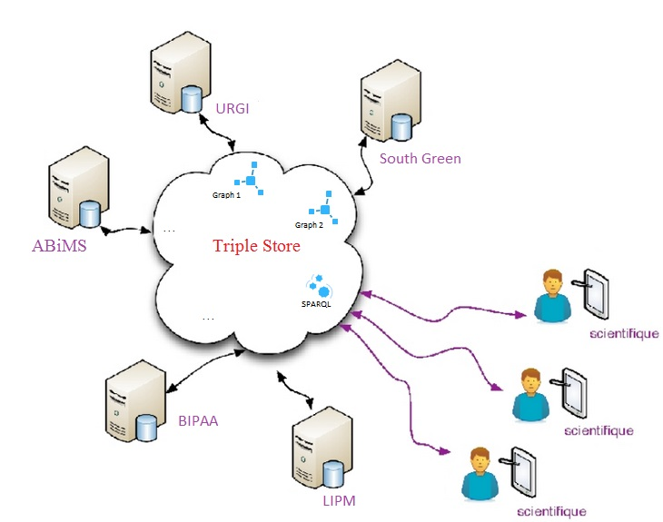
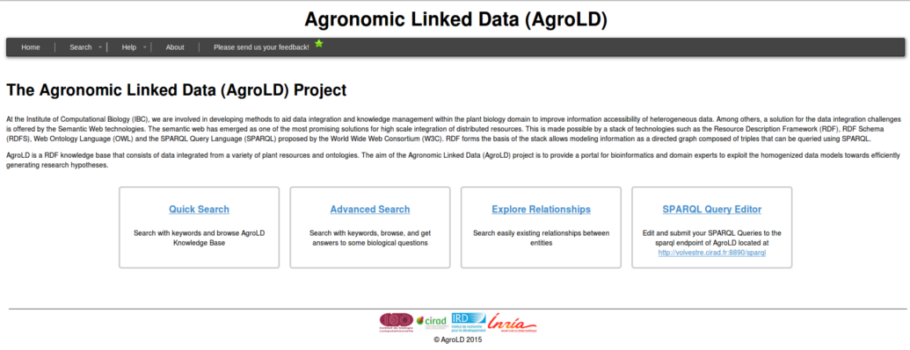

# AgroLD

AgroLD is a RDF knowledge base that consists of data integrated from a variety of plant resources and ontologies. The aim of the Agronomic Linked Data (AgroLD) project is to provide a portal for bioinformatics and domain experts to exploit the homogenized data models towards efficiently generating research hypotheses.




# The Architecture of project

- AgroLD_ETL
	- model
	- rdf_ttl
	- riceKB
	- test_files
	- riceKBpipeline.py
- agrold_webapp

### AgroLD_ETL

Contains parsers and model used to convert data considered for AgroLD to RDF.

* [model](/AgroLD_ETL/model): All documents who describe how data are transformed
* [rdf_ttl](/AgroLD_ETL/rdf_ttl): All output of transformation sort by dataset
* [riceKB](/AgroLD_ETL/riceKB): Contains scripts used for each data set
* [test_files](/AgroLD_ETL/test_files): All test files in input ( heterogeneous format: csv, tabbed files, gff3 )
* [riceKBpipeline.py](/AgroLD_ETL/riceKBpipeline.py): Script file where we have centralised all execution

###agrold_webapp

Scripts used for website UI, contains scripts for AgroLD API feature and all SPARQL query.
The front office (is any tools that has a direct relation to customers) of AgroLD web application are writed with JavaScript and the back office (interne fonctionnalities) are writed with JAVA.


```
For execute the projet in your local host:
/agrold_webapp/dist/agrold.war
load the war in your tomcat and go in localhost:8080/agrold
```




####[Quick search](http://volvestre.cirad.fr:8080/agrold/quicksearch.jsp)

Quick search is based on keyword search and aids in
understanding the underlying knowledge

####[Explore Relationships]( http://volvestre.cirad.fr:8080/agrold/relfinder.jsp)
The Explore Relationships tool aids in exploring relationships between existing entities.

####[Advanced Search](http://volvestre.cirad.fr:8080/agrold/advancedSearch.jsp)
The Advanced Search query form is based on the REST API suite, developed under the AgroLD project. The aim of this effort is to provide non-technical users with a tool to query the knowledge base.


####[SPARQL Query](http://volvestre.cirad.fr:8080/agrold/sparqleditor.jsp)
The SPARQL Query Editor provides an interactive environment to formulate SPARQL queries.


